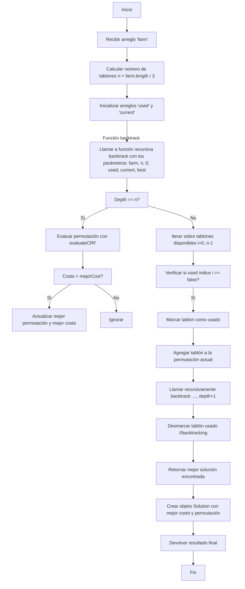
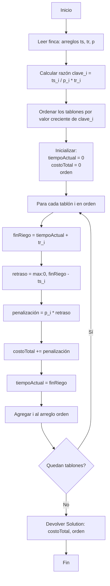

# Informe de Implementación — Problema del riego óptimo

## 0. Descripción del problema

El objetivo del proyecto es encontrar una programación óptima de riego para una finca, de manera que el costo total de riego sea mínimo.

El costo depende del retraso con que cada tablón recibe agua respecto a su tiempo máximo de supervivencia y de la prioridad asignada a cada uno.

### Definición formal

Dado un conjunto de $n$ tablones, cada uno con tres atributos:
- **Tiempo de supervivencia** ($ts_i$): tiempo de supervivencia del tablón
- **Tiempo de riego** ($tr_i$): tiempo que toma regar el tablón
- **Prioridad** ($p_i$): prioridad del tablón

Se busca obtener la mejor programación de riego para una finca, donde el costo de riego de un tablon $i$ está definido como:

$\text{CRF}(i, t) = p_i \cdot \max(0, t + tr_i - ts_i)$

donde $t$ es el tiempo de inicio del riego del tablón $i$.

### Ejemplo ilustrativo

**Tablones:**
1. $ts_1=5, tr_1=2, p_1=3$
2. $ts_2=8, tr_2=3, p_2=2$
3. $ts_3=6, tr_3=1, p_3=4$

**Objetivo:** Minimizar el costo total de riego comenzando en $t=0$.

**Análisis de permutaciones:**

- **Permutación [1,2,3]:**
  - Tablón 1 en $t=0$: $\text{CRF}(1,0) = 3 \cdot \max(0, 0+2-5) = 3 \cdot 0 = 0$
  - Tablón 2 en $t=2$: $\text{CRF}(2,2) = 2 \cdot \max(0, 2+3-8) = 2 \cdot 0 = 0$
  - Tablón 3 en $t=5$: $\text{CRF}(3,5) = 4 \cdot \max(0, 5+1-6) = 4 \cdot 0 = 0$
  - **Costo total: 0**

- **Permutación [2,3,1]:**
  - Tablón 2 en $t=0$: $\text{CRF}(2,0) = 2 \cdot \max(0, 0+3-8) = 2 \cdot 0 = 0$
  - Tablón 3 en $t=3$: $\text{CRF}(3,3) = 4 \cdot \max(0, 3+1-6) = 4 \cdot 0 = 0$
  - Tablón 1 en $t=4$: $\text{CRF}(1,4) = 3 \cdot \max(0, 4+2-5) = 3 \cdot 1 = 3$
  - **Costo total: 3**

- **Permutación [3,2,1]:**
  - Tablón 3 en $t=0$: $\text{CRF}(3,0) = 4 \cdot \max(0, 0+1-6) = 4 \cdot 0 = 0$
  - Tablón 2 en $t=1$: $\text{CRF}(2,1) = 2 \cdot \max(0, 1+3-8) = 2 \cdot 0 = 0$
  - Tablón 1 en $t=4$: $\text{CRF}(1,4) = 3 \cdot \max(0, 4+2-5) = 3 \cdot 1 = 3$
  - **Costo total: 3**

**Solución óptima:** Permutación [1,2,3] con costo total **0**.

**Observación:** Todos los tablones se riegan antes de su tiempo de supervivencia, evitando penalizaciones.

---

# 1. Lenguaje y herramientas usadas

- **Lenguaje:** Java 24  
- **Bibliotecas:** `java.util`, `java.io`  
- **Estructuras:** `ArrayList`, `HashMap`, `HashSet`, `Arrays`  
- **Medición de rendimiento:** `System.nanoTime()`  
- **Motivación:** Java permite un control detallado del tiempo, estructura modular del proyecto y detección temprana de errores por su tipado estático.

---

# 2. Estructura del proyecto

```bash
proyecto1/
│
├── src/proyecto1/
│   ├── FuerzaBruta.java
│   ├── EstrategiaVoraz.java
│   ├── ProgramacionDinamica.java
│   ├── Solution.java
│   ├── GuardarResultado.java
│   ├── LectorArchivo.java
│   └── Main.java
│
├── resources/
│   ├── entradas/
│   └── salidas/
│
└── docs/
    └── imagenes/
    └── informe.md
```

Cada clase cumple un rol específico:

| Clase | Función |
|--------|----------|
| `FuerzaBruta` | Genera todas las permutaciones posibles y selecciona la de menor costo. |
| `EstrategiaVoraz` | Usa una heurística basada en prioridad, supervivencia y tiempo de riego. |
| `ProgramacionDinamica` | Usa memoización para explorar todas las decisiones posibles de manera eficiente. |
| `LectorArchivo` | Carga los datos de entrada desde archivo de texto. |
| `GuardarResultado` | Exporta el resultado de cada estrategia a un archivo. |
| `Main` | Orquesta la ejecución de todas las estrategias y mide tiempos. |

---

# 3. Construcción de la solución

El sistema fue diseñado bajo un **enfoque modular**, donde cada técnica de resolución se implementa en una clase independiente dentro del paquete `proyecto1`.  
La clase `Main` coordina la ejecución secuencial de las tres estrategias: **Voraz**, **Fuerza Bruta** y **Programación Dinámica**.  

Cada estrategia resuelve el mismo problema: encontrar el orden de riego que **minimiza el Costo de Riego Final (CRF)** definido como:

**CRF total = Σ [ pᵢ × max(0, (t + trᵢ) - tsᵢ) ]**

donde:  
- `tsᵢ` es el tiempo de supervivencia del tablón *i*.  
- `trᵢ` es el tiempo de riego del tablón *i*.  
- `pᵢ` es su prioridad.  
- `t` es el tiempo acumulado antes de regar ese tablón.  

---

## 3.1 Estrategia Ingenua (Fuerza Bruta)

### Descripción de la técnica

La estrategia de **fuerza bruta** (o búsqueda exhaustiva) genera **todas las posibles permutaciones** de tablones (n!) y calcula el CRF para cada una.  
Finalmente, selecciona la permutación con **menor costo total**.  

Esta técnica **garantiza la solución óptima**, pero su costo computacional crece factorialmente, volviéndose inviable para n mayores a 10.  

Para implementarla, se utilizó un algoritmo recursivo de backtracking.
En cada nivel de recursión se elige un tablón aún no usado y se continúa hasta formar una permutación completa.
Al finalizar, se evalúa su costo con evaluateCRF.

---

### Fragmento central del algoritmo:

El método `backtrack()` explora recursivamente todas las permutaciones posibles:

```java
if (depth == n) {
    long cost = evaluateCRF(farm, current);
    if (cost < best.bestCost) {
        best.bestCost = cost;
        best.bestPerm = Arrays.copyOf(current, n);
    }
    return;
}
```

**Explicación:**  
- Cuando se han elegido n tablones (una permutación completa), se **calcula el costo total** con `evaluateCRF()`.  
- Si el costo es menor que el mejor conocido, se **actualiza la mejor solución**.  

En cada paso, se elige un tablón no usado para continuar construyendo la permutación:  

```java
for (int i = 0; i < n; i++) {
    if (!used[i]) {
        used[i] = true;
        current[depth] = i;
        backtrack(farm, n, depth + 1, used, current, best);
        used[i] = false;
    }
}
```

**Explicación:**  
- `used[]` controla qué tablones ya se incluyeron.  
- `current[]` guarda la secuencia parcial actual.  
- Cada llamada recursiva **profundiza una posición más** hasta completar una permutación válida.  

La función `evaluateCRF()` implementa el cálculo del costo total:

```java
for (int idx = 0; idx < n; idx++) {
    int ts = farm[tabIndex * 3];
    int tr = farm[tabIndex * 3 + 1];
    int p  = farm[tabIndex * 3 + 2];
    time += tr;
    long delay = Math.max(0, time - ts);
    totalCRF += p * delay;
}
```

**Explicación:**  
Para cada tablón:
- Se acumula su tiempo de riego.  
- Se calcula el **retraso** (`delay`) si el riego termina después de su tiempo de supervivencia.  
- Se agrega al **costo total** el producto de la prioridad por el retraso.  



### Conclusión

- **Exactitud:** 100%.  
- **Complejidad temporal:** O(n × n!)  
- **Espacial:** O(n).  
- Útil para pruebas o fincas pequeñas.  

---

## 3.2 Estrategia Voraz 

### Descripción de la técnica

La **estrategia voraz** busca una solución rápida aproximando el orden óptimo sin probar todas las combinaciones.  

Se basa en la heurística: $\text{clave}_i = \text{ts}_i / (p_i \times \text{tr}_i)$ 

Los tablones con **menor valor de clave** se riegan primero, priorizando aquellos con **baja supervivencia, alta prioridad y bajo tiempo de riego**.  

---

### Justificación 

La heurística fue elegida con base en una intuición de balance entre urgencia, tiempo y prioridad:

| Elemento | Cómo influye | Interpretación |
| --- | --- | --- |
| `ts_i` (supervivencia) | Cuanto **menor**, más urgente regar | Si el cultivo muere pronto, debe ir antes |
| `tr_i` (tiempo de riego) | Cuanto **mayor**, más tiempo bloquea el sistema | Evita regar tablones que tarden mucho si no son críticos |
| `p_i` (prioridad) | Cuanto **mayor**, más costoso el retraso | Debe recibir riego más pronto |
| → **Heurística combinada** | $\frac{ts_i}{p_i \times tr_i}$ | Integra esas tres dimensiones en una sola medida de “urgencia relativa” |

### 

- Si $(ts_i)$ es pequeño → el numerador es bajo → **el valor total baja**, por lo tanto se riega antes.
- Si $(p_i)$ o $(tr_i)$ son grandes → el denominador crece → **el valor baja**, lo que también prioriza ese tablón (porque regarlo tarde es costoso o consume mucho tiempo).
- En conjunto, el algoritmo **favorece los tablones más críticos** (poca supervivencia, alta prioridad, gran tiempo de riego).
---

#### Comparación con otras heurísticas posibles

| Heurística | Idea | Problema |
| --- | --- | --- |
| $$ts_i$$ | Regar primero el que menos sobrevive | Ignora prioridad y duración |
| $$\frac{ts_i}{tr_i}$$ | Equilibrio entre supervivencia y duración | No considera la importancia del tablón |
| $$\left(\frac{ts_i}{p_i \times tr_i}\right)$$ | Integra urgencia, duración y prioridad | Más equilibrada y representativa del costo global |

Por eso, **se escogió esta última**, ya que considera los **tres factores relevantes** del modelo del problema.

---
### Fragmentos de código relevantes

Ordenamiento inicial según la heurística:

```java
List<Integer> indices = new ArrayList<>();
for (int i = 0; i < n; i++) indices.add(i);

indices.sort(Comparator.comparingDouble(i ->
    (double) ts[i] / (p[i] * tr[i])
));
```

**Explicación:**  
- Se crea una lista de índices $(0 .... n−1)$. 
- Se usa un comparador que evalúa la expresión $ts / (p * tr)$ para cada tablón. 
- Luego se ordena según la fórmula anterior.  
- Este paso define el **orden de riego inicial** en $O(n log n)$.  

El cálculo del costo total se realiza después del ordenamiento:

```java
for (int i : indices) {
    int finRiego = tiempoActual + tr[i];
    int retraso = Math.max(0, finRiego - ts[i]);
    costoTotal += p[i] * retraso;
    tiempoActual = finRiego;
}
```

**Explicación:**  
Cada tablón se riega secuencialmente según el orden calculado, sumando su penalización si el riego se retrasa.  



### Ejemplo

Entradas consideradas (según el enunciado)

- **Finca F₁**  
$$F_1 = \langle \langle 10, 3, 4 \rangle, \langle 5, 3, 3 \rangle, \langle 2, 2, 1 \rangle, \langle 8, 1, 1 \rangle, \langle 6, 4, 2 \rangle \rangle$$

- **Finca F₂**  
$$F_2 = \langle \langle 9, 3, 4 \rangle, \langle 5, 3, 3 \rangle, \langle 2, 2, 1 \rangle, \langle 8, 1, 1 \rangle, \langle 6, 4, 2 \rangle \rangle$$

Cada tupla representa un tablón con:
$$
(ts_i, tr_i, p_i)
$$
donde:
- $( ts_i )$: tiempo de supervivencia del tablón,
- $( tr_i )$: tiempo de riego,
- $( p_i )$: prioridad.

El algoritmo voraz implementado en la clase `EstrategiaVoraz` ordena los tablones según la siguiente clave:

$$
\text{clave}_i = \frac{ts_i}{p_i \times tr_i}
$$

Los tablones con **menor valor** de esta expresión son regados primero, ya que representan los más urgentes (menor supervivencia, mayor prioridad o menor tiempo de riego).


#### Finca F₁

| i | $ts_i$ | $tr_i$| $p_i$ | $$\frac{ts_i}{p_i \times tr_i}$$ |
|--:|--:|--:|--:|--:|
| 0 | 10 | 3 | 4 | 0.833 |
| 1 | 5 | 3 | 3 | 0.556 |
| 2 | 2 | 2 | 1 | 1.000 |
| 3 | 8 | 1 | 1 | 8.000 |
| 4 | 6 | 4 | 2 | 0.750 |

**Orden voraz:**  
$$
[1, 4, 0, 2, 3]
$$

---

#### Finca F₂

| i | $ts_i$ | $tr_i$| $p_i$ | $$\frac{ts_i}{p_i \times tr_i}$$ |
|--:|--:|--:|--:|--:|
| 0 | 9 | 3 | 4 | 0.750 |
| 1 | 5 | 3 | 3 | 0.556 |
| 2 | 2 | 2 | 1 | 1.000 |
| 3 | 8 | 1 | 1 | 8.000 |
| 4 | 6 | 4 | 2 | 0.750 |

**Orden voraz:**  
$$[1, 0, 4, 2, 3]$$

El costo individual de regar un tablón $( i )$ en tiempo $( t )$ se define como:

$$CRF(i, t) = p_i \times \max(0, (t + tr_i) - ts_i)$$

y el **costo total de la finca** bajo una programación $( \Pi)$ es:
$$CRF_{\Pi} = \sum_{i=0}^{n-1} CRF(i, t_i)$$

donde $(t_i)$ es el tiempo acumulado antes de iniciar el riego del tablón $(i)$.

### Resultados para F₁
#### Orden voraz `[1, 4, 0, 2, 3]`

| Paso | Tablón | $t_{\text{inicio}}$ | $tr_i$ | $t_{\text{fin}}$ | $ts_i$ | Retraso | $p_i$ | Costo |
|--:|--:|--:|--:|--:|--:|--:|--:|--:|
| 1 | 1 | 0 | 3 | 3 | 5 | 0 | 3 | 0 |
| 2 | 4 | 3 | 4 | 7 | 6 | 1 | 2 | 2 |
| 3 | 0 | 7 | 3 | 10 | 10 | 0 | 4 | 0 |
| 4 | 2 | 10 | 2 | 12 | 2 | 10 | 1 | 10 |
| 5 | 3 | 12 | 1 | 13 | 8 | 5 | 1 | 5 |

$$CRF_{\text{voraz}}(F_1) = 17$$

#### Solución óptima (fuerza bruta): `[2, 1, 3, 0, 4]`

| Paso | Tablón | $t_{\text{inicio}}$ | $tr_i$ | $t_{\text{fin}}$ | $ts_i$ | Retraso | $p_i$ | Costo |
|--:|--:|--:|--:|--:|--:|--:|--:|--:|
| 1 | 2 | 0 | 2 | 2 | 2 | 0 | 1 | 0 |
| 2 | 1 | 2 | 3 | 5 | 5 | 0 | 3 | 0 |
| 3 | 3 | 5 | 1 | 6 | 8 | 0 | 1 | 0 |
| 4 | 0 | 6 | 3 | 9 | 10 | 0 | 4 | 0 |
| 5 | 4 | 9 | 4 | 13 | 6 | 7 | 2 | 14 |

$$CRF_{\text{óptimo}}(F_1) = 14$$

**Conclusión:**  
$$CRF_{\text{voraz}} = 17 > CRF_{\text{óptimo}} = 14$$

El algoritmo voraz **no produce la solución óptima** en F₁.

---

### Resultados para F₂

#### Orden voraz `[1, 0, 4, 2, 3]`

| Paso | Tablón | $t_{\text{inicio}}$ | $tr_i$ | $t_{\text{fin}}$ | $ts_i$ | Retraso | $p_i$ | Costo |
|--:|--:|--:|--:|--:|--:|--:|--:|--:|
| 1 | 1 | 0 | 3 | 3 | 5 | 0 | 3 | 0 |
| 2 | 0 | 3 | 3 | 6 | 9 | 0 | 4 | 0 |
| 3 | 4 | 6 | 4 | 10 | 6 | 4 | 2 | 8 |
| 4 | 2 | 10 | 2 | 12 | 2 | 10 | 1 | 10 |
| 5 | 3 | 12 | 1 | 13 | 8 | 5 | 1 | 5 |

$$CRF_{\text{voraz}}(F_2) = 23$$

#### Solución óptima (fuerza bruta): `[2, 1, 3, 0, 4]`

| Paso | Tablón | $t_{\text{inicio}}$ | $tr_i$ | $t_{\text{fin}}$ | $ts_i$ | Retraso | $p_i$ | Costo |
|--:|--:|--:|--:|--:|--:|--:|--:|--:|
| 1 | 2 | 0 | 2 | 2 | 2 | 0 | 1 | 0 |
| 2 | 1 | 2 | 3 | 5 | 5 | 0 | 3 | 0 |
| 3 | 3 | 5 | 1 | 6 | 8 | 0 | 1 | 0 |
| 4 | 0 | 6 | 3 | 9 | 9 | 0 | 4 | 0 |
| 5 | 4 | 9 | 4 | 13 | 6 | 7 | 2 | 14 |

$$CRF_{\text{óptimo}}(F_2) = 14$$

**Conclusión:**
$$CRF_{\text{voraz}} = 23 > CRF_{\text{óptimo}} = 14$$

El algoritmo voraz **no obtiene la solución óptima** en F₂.

### Análisis comparativo

| Estrategia | Finca | Orden obtenido | $CRF_{\Pi}$ | ¿Óptimo? |
|-------------|--------|----------------|----------------|-----------|
| Voraz | F₁ | [1, 4, 0, 2, 3] | 17 | NO |
| Fuerza Bruta | F₁ | [2, 1, 3, 0, 4] | 14 | SI |
| Voraz | F₂ | [1, 0, 4, 2, 3] | 23 | NO |
| Fuerza Bruta | F₂ | [2, 1, 3, 0, 4] | 14 | SI |

- Para las fincas F₁ y F₂, el algoritmo voraz no alcanza la solución óptima obtenida por fuerza bruta.  

- Su desempeño, sin embargo, es eficiente temporalmente $(O(n \log n))$, mientras que la fuerza bruta crece factorialmente.  

### Conclusión


